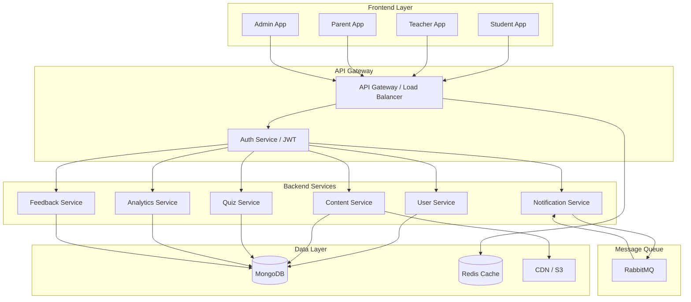
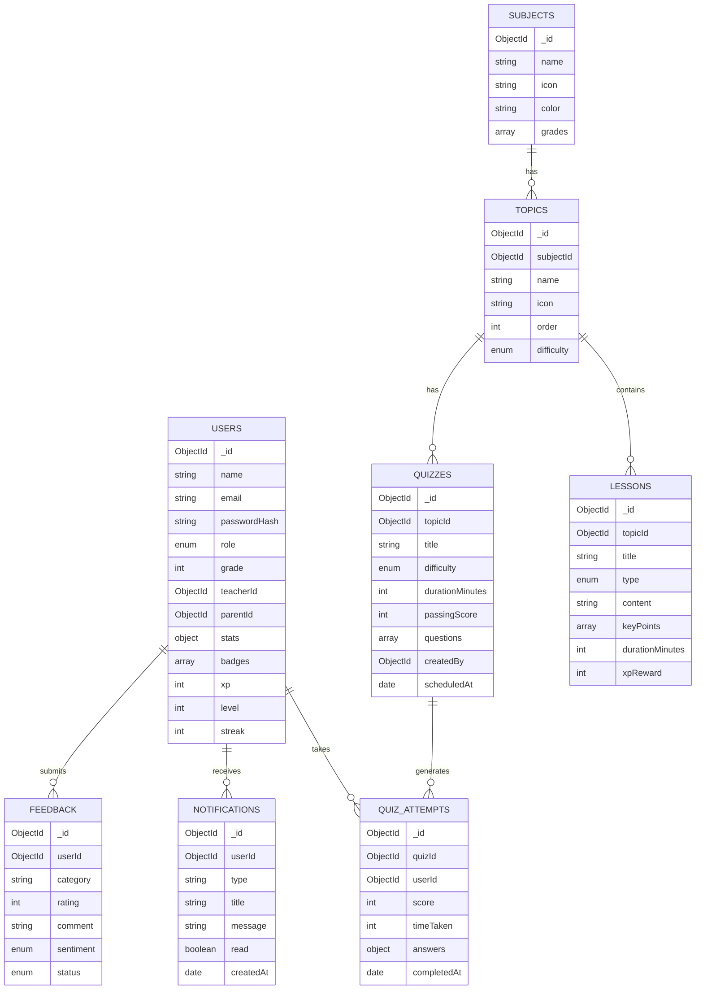
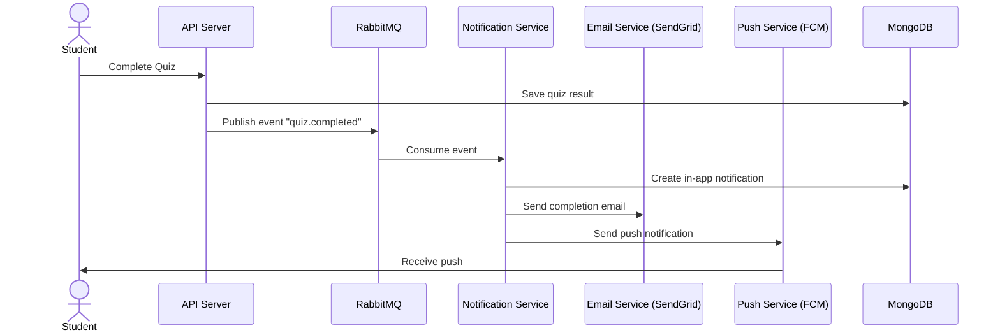
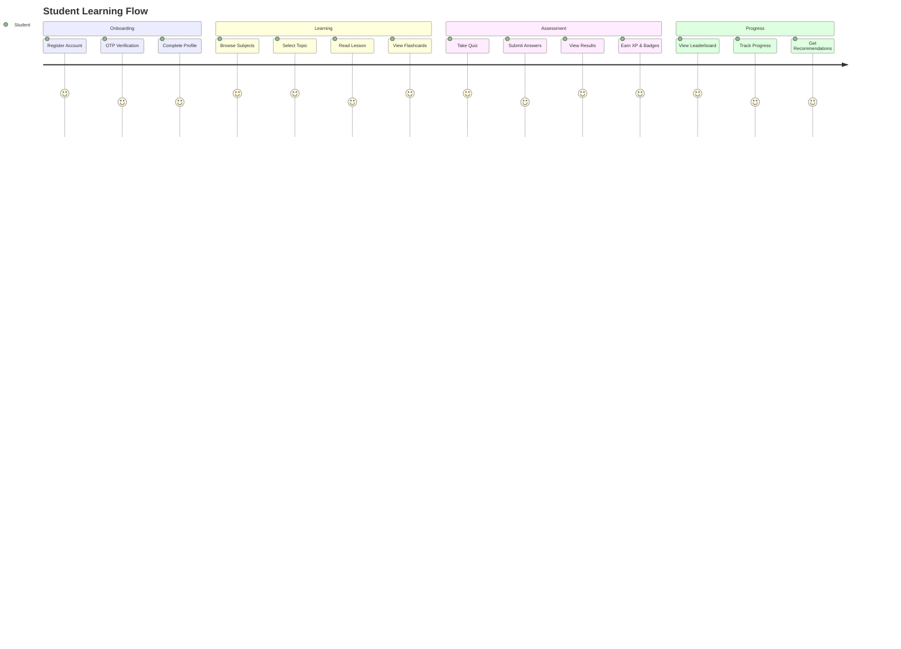
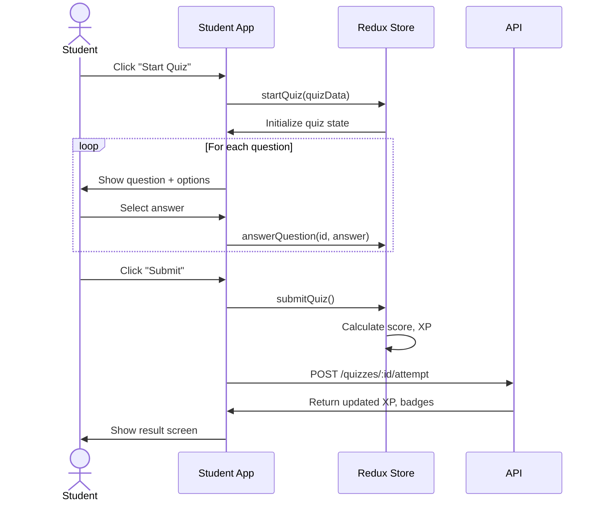
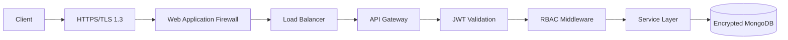
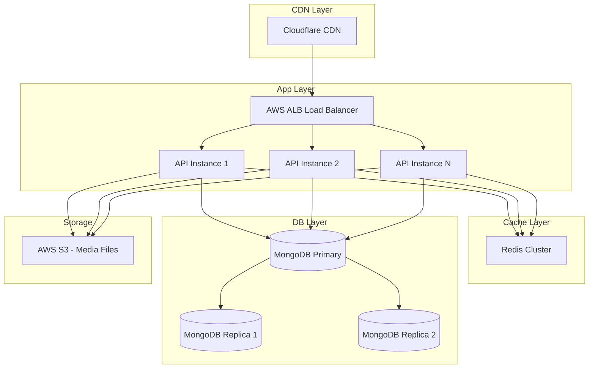

# OlympQuiz - Architecture & Design Documentation

> **Version**: 1.0.0 | **Date**: June 2024 | **Type**: POC

---

## 1. Product Overview

OlympQuiz is a mobile-first educational quiz platform for students from **Nursery to Class 5**. It combines learning, assessment, gamification, progress tracking, and parent-teacher engagement.

### Core Subjects
- 🔢 Mathematics
- 📚 English  
- 🌍 General Knowledge (GK)

### User Personas
| Persona | Theme | Primary Use |
|---------|-------|-------------|
| Student | Fun & Playful | Learn, Practice, Quiz |
| Teacher | Professional | Create, Assign, Report |
| Parent | Informative | Monitor, Communicate |
| Admin | Enterprise | Manage, Moderate, Analyze |

---

## 2. Information Architecture

```
OlympQuiz/
├── Auth
│   ├── Login
│   ├── Register (3-step wizard)
│   ├── Forgot Password
│   └── OTP Verification
│
├── Student Portal
│   ├── Dashboard (Home)
│   ├── Subjects → Topics → Lessons
│   ├── Flashcards
│   ├── Quizzes → Active Quiz → Results
│   ├── Leaderboard
│   ├── Achievements & Badges
│   ├── Progress Analytics
│   └── Notifications
│
├── Teacher Portal
│   ├── Dashboard
│   ├── Content Management (CRUD)
│   ├── Quiz Management (Create/Assign/Schedule)
│   ├── Reports & Analytics
│   └── Communication (Announcements/Messages)
│
├── Parent Portal
│   ├── Dashboard
│   ├── Child Progress
│   ├── Reports (Weekly/Monthly)
│   └── Communication (Messages/Feedback)
│
└── Admin Console
    ├── Dashboard
    ├── User Management
    ├── Content Moderation
    ├── Platform Analytics
    └── Feedback Management
```

---

## 3. System Architecture

### High-Level Architecture



---

## 4. Monorepo Architecture

```
olympquiz/                          # Root monorepo
├── package.json                    # pnpm workspace config
├── turbo.json                      # Turborepo pipeline config
│
├── apps/
│   ├── student-app/                # React Vite - Student PWA
│   ├── teacher-app/                # React Vite - Teacher Dashboard
│   ├── parent-app/                 # React Vite - Parent Portal
│   ├── admin-app/                  # React Vite - Admin Console
│   └── api/                        # Node.js + Express REST API
│       ├── src/
│       │   ├── controllers/
│       │   ├── services/
│       │   ├── repositories/
│       │   ├── middlewares/
│       │   ├── models/
│       │   └── routes/
│       └── package.json
│
└── packages/
    ├── ui/                         # Shared MUI components
    ├── tokens/                     # Design tokens (colors, typography)
    ├── hooks/                      # Shared React hooks
    ├── utils/                      # Shared utility functions
    ├── api-client/                 # Axios API client with interceptors
    ├── types/                      # TypeScript types/interfaces
    └── eslint-config/              # Shared ESLint configuration
```

### Turborepo Pipeline (turbo.json)
```json
{
  "pipeline": {
    "build": { "dependsOn": ["^build"], "outputs": ["dist/**"] },
    "dev": { "cache": false, "persistent": true },
    "lint": { "outputs": [] },
    "test": { "dependsOn": ["build"] }
  }
}
```

---

## 5. Database Design (MongoDB)

### Collections & Schemas



### Indexing Strategy
```javascript
// Users Collection
db.users.createIndex({ email: 1 }, { unique: true })
db.users.createIndex({ role: 1 })
db.users.createIndex({ teacherId: 1 })

// Quiz Attempts
db.quizAttempts.createIndex({ userId: 1, quizId: 1 })
db.quizAttempts.createIndex({ quizId: 1, score: -1 }) // For leaderboard

// Notifications
db.notifications.createIndex({ userId: 1, read: 1 })
db.notifications.createIndex({ createdAt: 1 }, { expireAfterSeconds: 2592000 }) // 30-day TTL

// Lessons
db.lessons.createIndex({ topicId: 1, order: 1 })
```

---

## 6. API Design

### Base URL: `https://api.olympquiz.com/v1`

### Authentication Endpoints
```
POST /auth/login              - Login with email/password
POST /auth/register           - Register new user
POST /auth/otp/send           - Send OTP
POST /auth/otp/verify         - Verify OTP
POST /auth/refresh-token      - Refresh JWT
POST /auth/logout             - Logout
POST /auth/forgot-password    - Initiate password reset
```

### Student Endpoints
```
GET  /subjects                - List all subjects
GET  /subjects/:id/topics     - Get topics by subject
GET  /topics/:id/lessons      - Get lessons by topic
GET  /quizzes                 - List quizzes (filterable)
GET  /quizzes/:id             - Get quiz by ID
POST /quizzes/:id/attempt     - Submit quiz attempt
GET  /students/:id/progress   - Get student progress
GET  /students/:id/history    - Get quiz history
GET  /leaderboard             - Get leaderboard
GET  /notifications           - Get user notifications
PUT  /notifications/:id/read  - Mark notification as read
```

### Teacher Endpoints
```
POST   /content               - Create content
PUT    /content/:id           - Update content
DELETE /content/:id           - Delete content
POST   /quizzes               - Create quiz
PUT    /quizzes/:id           - Update quiz
POST   /quizzes/:id/assign    - Assign quiz to class
GET    /reports/class         - Class performance report
GET    /reports/topic/:id     - Topic analytics
POST   /announcements         - Send announcement
```

### Admin Endpoints
```
GET    /admin/users           - List all users
POST   /admin/users           - Create user
PUT    /admin/users/:id       - Update user
DELETE /admin/users/:id       - Delete user
GET    /admin/content/pending - Pending approvals
PUT    /admin/content/:id/approve - Approve content
GET    /admin/analytics       - Platform analytics
GET    /admin/feedback        - All feedback
```

---

## 7. Notification Architecture

### Recommendation: **RabbitMQ**

**Why RabbitMQ over Kafka or AWS SQS for this POC?**

| Factor | RabbitMQ | Kafka | AWS SQS |
|--------|----------|-------|---------|
| Complexity | Low ✅ | High | Medium |
| POC Setup | Simple ✅ | Complex | Moderate |
| Cost | Free ✅ | Infrastructure $ | Pay-per-use |
| Latency | Low ✅ | Very Low | Low |
| Scalability | Good ✅ | Excellent | Excellent |
| Message Routing | Flexible ✅ | Topic-based | Queue-based |

**Recommendation**: Start with **RabbitMQ** for POC. Migrate to **Kafka** when concurrent users exceed 5,000.

### Notification Flow



### Notification Channels
1. **In-App**: Stored in MongoDB, shown via polling/WebSocket
2. **Email**: SendGrid integration with HTML templates  
3. **Push**: Firebase Cloud Messaging (FCM)

---

## 8. User Journey Flows

### Student Learning Journey



### Quiz Flow Sequence



---

## 9. Design System Specification

### Color Tokens

| Token | Value | Usage |
|-------|-------|-------|
| `primary.500` | `#6C63FF` | Student theme primary |
| `secondary.500` | `#FF6B35` | Student theme secondary |
| `teacher.primary` | `#1E40AF` | Teacher portal |
| `parent.primary` | `#0F766E` | Parent portal |
| `admin.primary` | `#1E293B` | Admin console |
| `success.main` | `#10B981` | Success states |
| `warning.main` | `#F59E0B` | Warning states |
| `error.main` | `#EF4444` | Error states |

### Typography Scale

| Variant | Size | Weight | Usage |
|---------|------|--------|-------|
| h1 | 3rem | 800 | Page titles |
| h2 | 2.25rem | 700 | Section titles |
| h4 | 1.5rem | 600 | Card titles |
| body1 | 1rem | 400 | Body text |
| caption | 0.75rem | 400 | Labels |

### Spacing (4px Grid)
```
4px → xs  |  8px → sm  |  16px → md  |  24px → lg  |  32px → xl
```

### Border Radius
- Cards: `16px`
- Buttons: `12px`  
- Chips: `100px` (pill)
- Inputs: `12px`
- Modals: `20px`

---

## 10. Gamification System

| Element | Rules |
|---------|-------|
| XP | Earned on lesson completion (50-100 XP) and quiz scores |
| Level | Every 500 XP = 1 level up |
| Streak | Consecutive daily learning days |
| Badges | Earned for specific milestones (quiz scores, streaks, topics) |
| Leaderboard | Weekly/Monthly XP ranking, class & global |

### XP Formula
```
Quiz XP = round(score_percentage × 0.5 × max_xp_reward)
Lesson XP = base_lesson_xp (50-100)
```

---

## 11. Security Architecture



### Security Measures
- **JWT** with 15-min access tokens + 7-day refresh tokens
- **RBAC** with 4 roles: student, teacher, parent, admin
- **Rate Limiting**: 100 req/min per IP on auth endpoints
- **Input Validation**: Joi/Zod schema validation on all inputs
- **MongoDB**: Field-level encryption for PII
- **HTTPS**: TLS 1.3 enforced
- **OWASP Top 10**: Mitigations implemented for all categories
- **CORS**: Strict origin allowlist
- **Helmet.js**: HTTP security headers

---

## 12. Scalability & Deployment

### Expected Capacity
- **Phase 1 (POC)**: 100-500 concurrent users
- **Phase 2**: 1,000-5,000 concurrent users  
- **Phase 3**: 5,000-10,000 concurrent users

### Deployment Architecture



### Caching Strategy
| Data Type | Cache Duration | Strategy |
|-----------|----------------|----------|
| Subject/Topic lists | 1 hour | Redis cache-aside |
| Quiz questions | 30 mins | Redis read-through |
| Leaderboard | 5 mins | Redis sorted sets |
| User session | 15 mins | Redis TTL |
| Static assets | 30 days | CDN |

---

## 13. Component Inventory

### Common Components
- `StatCard` - Metric display card with icon
- `QuizCard` - Quiz preview with difficulty badge
- `SubjectCard` - Subject with gradient and progress
- `BadgeCard` - Achievement badge with tooltip
- `ProgressBar` - Labeled linear progress

### Layout Components
- `StudentLayout` - Mobile bottom nav + top bar
- `TeacherLayout` - Sidebar drawer + top bar
- `ParentLayout` - Sidebar drawer + top bar  
- `AdminLayout` - Dark sidebar + top bar

### Feature Screens (44 total)
- **Auth**: Login, Register, ForgotPassword, OTPVerification (4)
- **Student**: Dashboard, Subjects, Topics, Lessons, Flashcards, QuizList, QuizPage, QuizResult, Leaderboard, Achievements, Progress, Notifications (12)
- **Teacher**: Dashboard, ContentMgmt, QuizMgmt, Reports, Communication (5)
- **Parent**: Dashboard, ChildProgress, Reports, Communication (4)
- **Admin**: Dashboard, UserMgmt, ContentModeration, Analytics, Feedback (5)

---

## 14. Future Roadmap

### Phase 2 (Months 3-6)
- [ ] Live quiz battle mode (multiplayer)
- [ ] Video lessons with progress tracking
- [ ] AI-powered question generation
- [ ] Voice-enabled learning for early grades
- [ ] Offline PWA support
- [ ] Hindi language support

### Phase 3 (Months 6-12)
- [ ] AR flashcards (augmented reality)
- [ ] Adaptive learning paths (AI)
- [ ] Parent-teacher video calls
- [ ] Science subject addition
- [ ] iOS/Android native apps
- [ ] School/District management

### Phase 4 (Year 2)
- [ ] Multi-language support (10+ languages)
- [ ] API for third-party integration
- [ ] White-label product offering
- [ ] B2B school licensing model
- [ ] Advanced AI tutoring

---

## 15. WCAG 2.2 AA Compliance

| Requirement | Implementation |
|-------------|----------------|
| Color Contrast | 4.5:1 minimum ratio on all text |
| Touch Targets | Minimum 44×44px (mobile) |
| Keyboard Navigation | Full tab support, visible focus rings |
| Screen Readers | ARIA labels on all interactive elements |
| Responsive Typography | rem-based, scales with browser settings |
| Focus Management | Modal focus trap, skip navigation links |
| Error Messages | Clear, descriptive error descriptions |
| Alternative Text | All images have descriptive alt text |

---

*Built with ❤️ | OlympQuiz v1.0.0 POC*
